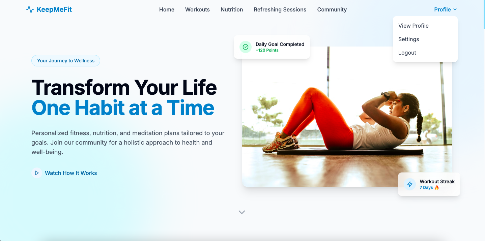
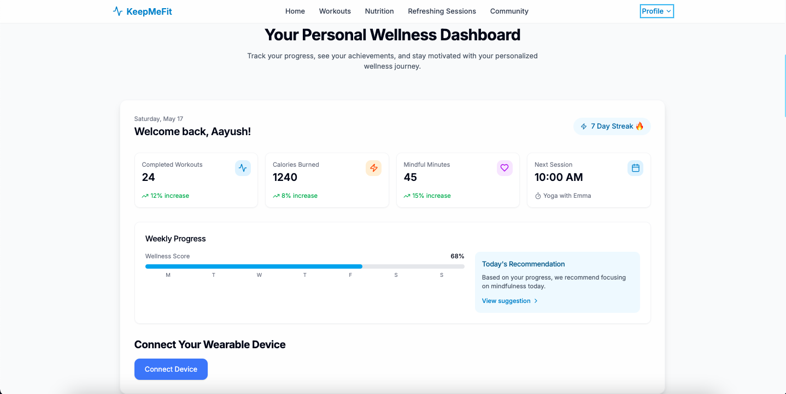
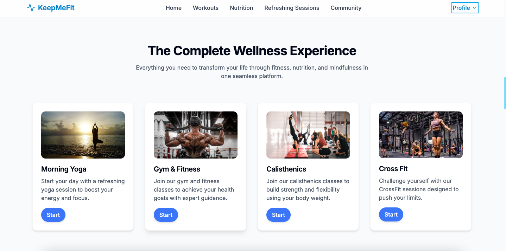
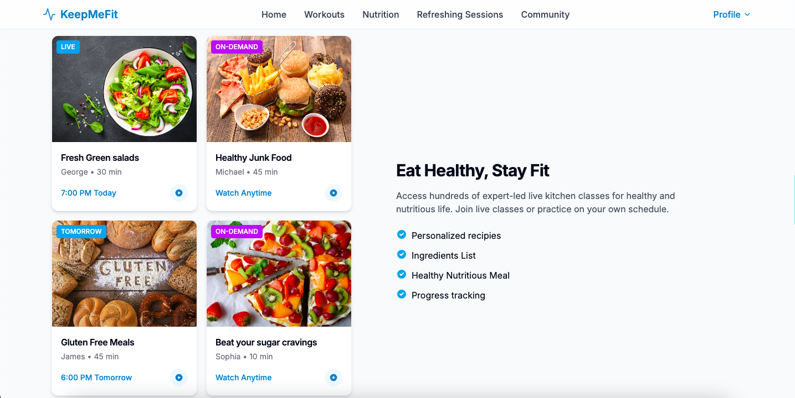
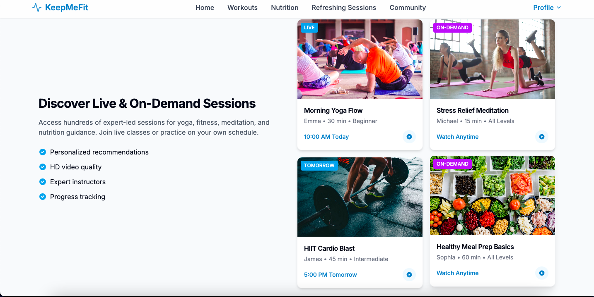
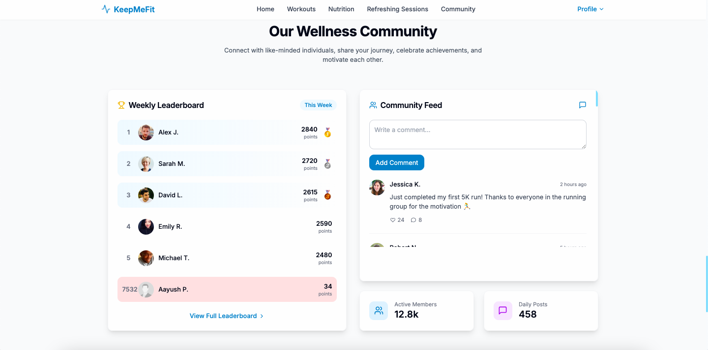

---

# 🏋️‍♂️ KeepMeFit – Your Personalized Fitness Companion

[Live Demo 🚀](https://keep-me-fit.vercel.app/)

---

## Overview

**Fitfluence** is a modern, user-friendly fitness platform designed to help users achieve their health and wellness goals. Whether you’re a beginner or a seasoned athlete, Fitfluence offers personalized workout plans, nutrition tracking, progress monitoring, and motivational insights-all in one place.

---

## Home Page



## Personalised Dashboard



## Workout Recommendation



## Nutrition Recommendation



## Refreshing Sessions



## Community Engagement



--

## Features

- **Personalized Workout Plans:**
Get daily routines reccomendation to your fitness level and goals.
- **Nutrition recommendation:**
Log meals, track macros, and receive healthy recipe suggestions.
- **Progress Dashboard:**
Visualize your fitness journey with  statistics.
- **Community Support:**
Share achievements and connect with fellow fitness enthusiasts.
- **Responsive Design:**
Seamless experience on desktop, tablet, and mobile devices.

---

## Tech Stack

- **Frontend:** React.js, Tailwind CSS, Chart.js
- **Backend:** FastAPI (if applicable)
- **Hosting:** Vercel

---

## Getting Started

### Prerequisites

- Node.js (v14+)
- npm or yarn


### Installation

1. **Clone the repository:**

```bash
git clone https://github.com/AayushPatel006/fitfluence-experience.git
cd fitfluence-experience
```

2. **Install dependencies:**

```bash
npm i
```

3. **Start the development server:**

```bash
npm run dev
```

The app will be available at `http://localhost:8080`.

---

## Project Structure

```
fitfluence-experience/
├── public/
├── src/
│   ├── components/
│   ├── pages/
│   ├── assets/
│   └── ...
├── package.json
├── README.md
└── ...
```


---

## Contributing

Contributions are welcome!
To contribute:

1. Fork this repository
2. Create a new branch (`git checkout -b feature/your-feature`)
3. Commit your changes (`git commit -m 'Add some feature'`)
4. Push to the branch (`git push origin feature/your-feature`)
5. Open a Pull Request

---

## License

This project is for educational and demonstration purposes.

---

**Made with 💪 by Team Fitfluence**

---
